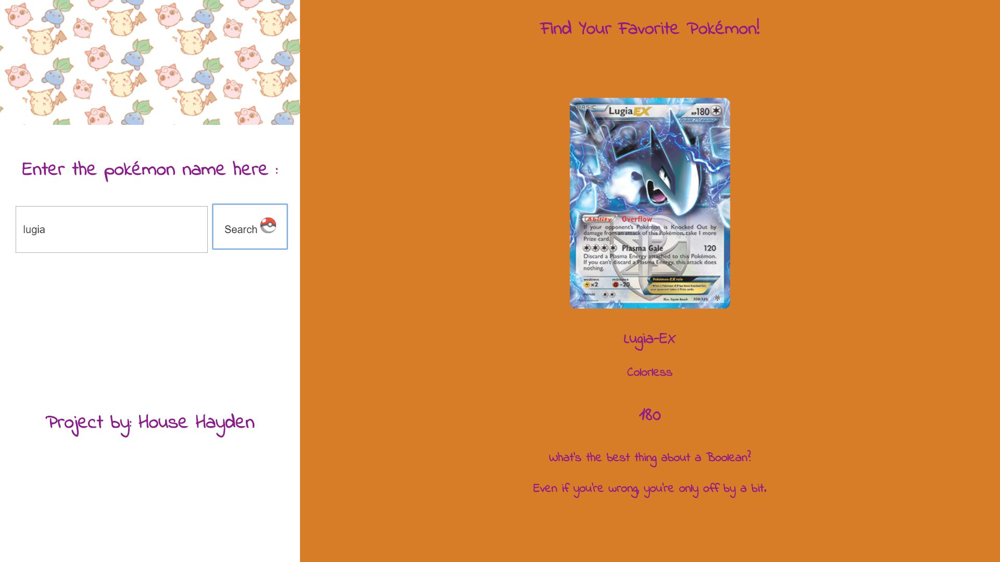

Pokemon Complex API
This project was designed to allow the user to search for a pokemon and they would find out that pokemon's type and hp along with that a joke would be displayed at the bottom of the page. The pokemon info would come from one API and the joke would come from another API so we would incorporate 2 API's into one page.

Link to project:https://rakimdevcraig.github.io/PokemonAPIcomplex/

How It's Made:
Tech used: HTML, CSS, JavaScript, jQuery, API's
This project came from my initial pokemon API project. On top of that project I got an API that has a setup
and a punchline and setup an ajax request with it. If the request was successful it would take those parameters and add them to a paragraph with the .html method.

Lessons Learned:
Multiple API's can be incorporated into a project. I had alot of struggles simply finding an API that would work but after I did then I had to get creative on how to tie them together. In the end I got both of them to work together before this project I was only incorporating 1 API into my applications but now I know the possibilities are endless.

Optimizations:
I would like to incorporate more API's into this page but I just haven't come across an idea that makes sense. When I do this app will have more functionality!

Examples:
Take a look at these couple examples that I have in my own portfolio:
